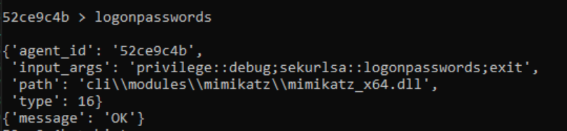

# **Final Project Tests**

We will now demonstrate the tests we have performed on our Final Project and how our Final Project is working as expected.

### **Part 0 - W4 Warnings**

We have successfully resolved our W4 warnings and got rid of them. The following image shows our configuration regarding the W4 warnings:


### **Part 3 - Configuration Changes for Release**

We have made changes instructed to us in Part 3, where we change client configuration for x64 Release, so that the console of *Client.exe* is not shown when we run *Client.exe*.

The following image shows the configuration that we did:


## **Setup**
In order to test our project, please follow these steps that will help you setup the environment:
* Run "run-server.bat" file located in Server/ directory. This will start the server.
* Run "run-cli.bat" file located in Server/ directory. This will open a CLI tool to interact with the server.
* Run "compile.bat" file located in Client/ directory from the native cmd.
* Run "run.bat" file located in Client/ directory or simply run the "Client.exe" file present in Client/ directory.

Note that for some test cases we will run Client.exe in medium integrity (i.e., normally) while in some cases we will run Client.exe in high integrity (i.e., as administrator). We have mentioned when to run Client.exe in which integrity level.

Now, after the setup is done, we begin testing our peoject. Open the CLI, and type in the following command:
```raw
> agents
```
This will give you a new prompt as shown below:
```raw
agents >
```
Now, we will use our agent by typing in the following command, as is also shown in the figure above:
```raw
agents > use 401d8adf
```
NOTE: For the sake of testing purpose, we have used an agent ID which was created when we ran Client.exe on our system. Please replace the agent ID with the one that is assigned to your agent when you are testing on your own system. This should be applied to all the commands that are mentioned furhter in this document. Also, the agent ID is subject to change in this document as well, as we will see further into the document.

After entering this command, notice the change in the command prompt, which changed from *agents* to your agent ID, as shown below:
```raw
401d8adf >
```

Now we are ready to test out our new functionalities which are added in this project.

## **Testing**

Now that the setup is complete, we will now test all the functionalities of this project that includes all the commands in CLI.

### **Test 1 - logonpasswords (Mimikatz, Part 1)**

We have incorporated the mimikatz DLL to our project. Hence, we can use mimikatz functionality from our CLI. Type in the following command to test Mimikatz functionalities:

```raw
52ce9c4b > logonpasswords
```

The output will be similar to the following image:



Now, to see the result, identify the *Task ID* of this command, and type in the following command to view its results:

```raw
52ce9c4b > task 975e0b22
```

The output will be similar to as shown in the image below:


Note that the Mimikatz DLL is loaded. However, it is not yet able to parse multiple commands of Mimikatz hence it is not giving output as expected. But, our Mimikatz DLL is successfully loaded.

### **Test 2 - Updated Help Command (Part 3)**

We have updated the *help* command. Now, we can also give an argument to the *help* command to list down information and usage of a particular agent interactive command. Type in the following command to list down information regarding *download* command:

```raw
401d8adf > help download
```

The output in the CLI will be similar to the image shown below:


As you can see, the information regarding the *download* function is printed along with its usage information, i.e., information on how to use it.

Similarly, you can use this to display information of other commands too. Type in the following command to display help information regarding *upload* commad:

```raw
401d8adf > help upload
```

The output in the CLI will be similar to the image shown below:


As you can see, the information regarding the *upload* function is printed along with its usage information, i.e., information on how to use it.
