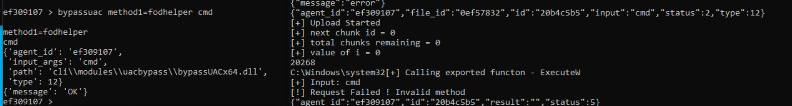
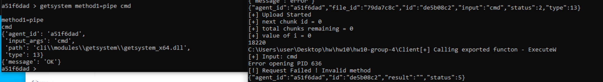

# **HW10 Tests**

## **Setup**
In order to test our project, please follow these steps that will help you setup the environment:
* Run "run-server.bat" file located in Server/ directory. This will start the server.
* Run "run-cli.bat" file located in Server/ directory. This will open a CLI tool to interact with the server.
* Run "compile.bat" file located in Client/ directory from the native cmd.
* Run "run.bat" file located in Client/ directory or simply run the "Client.exe" file present in Client/ directory.

Note that for some test cases we will run Client.exe in medium integrity (i.e., normally) while in some cases we will run Client.exe in high integrity (i.e., as administrator). We have mentioned when to run Client.exe in which integrity level.

Now, after the setup is done, we begin testing our peoject. Open the CLI, and type in the following command:
```raw
> agents
```
This will give you a new prompt as shown below:
```raw
agents >
```
Now, we will use our agent by typing in the following command, as is also shown in the figure above:
```raw
agents > use 66d05a29
```
NOTE: For the sake of testing purpose, we have used an agent ID which was created when we ran Client.exe on our system. Please replace the agent ID with the one that is assigned to your agent when you are testing on your own system. This should be applied to all the commands that are mentioned furhter in this document. Also, the agent ID is subject to change in this document as well, as we will see further into the document.

After entering this command, notice the change in the command prompt, which changed from *agents* to your agent ID, as shown below:
```raw
66d05a29 >
```
Now we are ready to test out our new functionalities which are added in this project.

## **Testing**

Now that the setup is completed, we will move forward and test our new functionalities. The two new functionalities are as follows:
* BypassUAC (Task type = 12) - This functionality allows us to spawn any application or run a command via command prompt with high integrity level, provided the current use is in Local Admin group.
* Getsystem (Task type = 13) - This functionality allows us to spawn any application or run a command via command prompt with SYSTEM integrity level, provided the implant, or Client.exe, already has high integrity level or is ran with high integrity level to begin with.

Apart from these two functionalities, we have also fixed our code in *sysinfo* functionality to display proper MachineGUID based on the real MachineGUID instead of a static one in older versions.

The testing is divided into two parts as follows:
* Success Test - These are the success test cases as defined in the assignment description. Here, the functioning of the newly implemented features are shown with their output to show that they are working as expected when an expected input is provided. The following are the success tests:
    * Success Test 1 - MachineGUID in sysinfo: Shows that MachineGUID is successfully displayed when we display sysinfo in CLI.
    * Success Test 2 - BypassUAC to spawn high integrity level command prompt, from a user in Local Admin group.
    * Success Test 3 - BypassUAC to create a new user.
    * Success Test 4 - Getsystem to spawn SYSTEM integrity level command prompt, while running Client.exe in high integrity level.
    * Success Test 5 - Getsystem to create a new user.
* Failure Test - These are the failure test cases as defined in the assignment description. Here, the new functionalities are used in an unexpected way, to basically show error handling. The following are the failure tests:
    * Failure Test 1 - BypassUAC to spawn high integrity level command prompt, from a user *not* in Local Admin group. This should fail and it will, as you will see.
    * Failure Test 2 - Getsystem to spawn SYSTEM integrity level command prompt, while running Client.exe in medium integrity level. This should also fail and it will, as you will see.

We will now test out these new features in hw10.

### **Success Test 1 - MachineGUID in sysinfo**

Follow the following steps to perform this test:

* Run Client.exe normally, or in medium integrity level. You can do that by simply double-clicking the Client.exe generated or running *run.bat* script in medium integrity level.
* Note down the agent ID assigned. In our case, it is *66d05a29*.
* Follow the steps mentioned in *Setup* section, and get to the agent command prompt.
* Type in the following command to get *sysinfo* output:

```raw
66d05a29 > sysinfo
```

This will print out system information of the target machine. Now, you can see the MachineGUID which is equal to the real MachineGUID of the machine. The followng is an image of how it looks like:


This shows that MachineGUID is displayed fine.

### **Success Test 2 - BypassUAC to spawn high integrity level Command Prompt**

In this test, we will be operating from a user who is in the Local Admin group. This allows the user to elevate to admin rights. If a user is not in this group, then that user is not allowed to have elevated rights.

NOTE: If you are testing on your machine, make sure you are running Client.exe from a user that is already present in Local Admin group.

Now, follow the following steps in order to execute this test:

* Open Client.exe normally, i.e. in medium integrity level and note down the agent ID. In our case it is *8e00a997*.
* Follow the steps in *Setup* to go to the agent command prompt in CLI.
* Type in the following command to spawn a command prompt in high integrity level:

```raw
8e00a997 > bypassuac method1=fodhelper cmd
```

This will soon spawn a command prompt in high integrity level. To verify this, type in the following command in the spawned command prompt:

```raw
> whoami /groups | findstr Level
```

The integrity level will be mentioned in the output of this command, which will be *High* in this case. The following image depicts this test case:


Note that the integrity level mentioned in the output is *High*. This shows that our test is successful and the feature is working as expected.

### **Success Test 3 - BypassUAC to Create a New User**

In this test, we will create a new user using bypassuac functionality since this process requires admin rights (high integerity level).

The new user will have username as *test1* and the password will be *Password1!*.

We already have an agent from the previous test on which we will continue this test. Follow the following steps to do this test:

* Type in the following command to create a new user using bypassuac functionality:

```raw
8e00a997 > bypassuac method1=fodhelper net user test1 Password1! /add
```

This will create a new user on the system with the username as *test1* and the password as *Password1!*.

To verify the creation of this new user, open a command prompt (you can open in medium integrity level) on the target machine and type in the following command:

```raw
> net user
```

This will display all the users present on the machine. You will notice that *test1* shows up in this list. The following image depicts this test case:


Note that *test1* is listed among the users in the system. Hence, this shows that our feature is working fine and test case is successful.

### **Success Test 4 - Getsystem to spawn SYSTEM integrity level Command Prompt**

In this test, we will be opening the Client.exe as administrator, that is, in high integrity level, as then only it will work. This is because we can only elevate to SYSTEM level of integrity if we are at High level of integrity. We will then spawn command prompt in SYSTEM integrity level using *getsystem* functionality.

Follow the following steps in order to perform this test:

* Open the Client.exe as administrator and note down the agent ID. In our case, it is *14297f3d*.
* Follow the steps in *Setup* to go to the agent command prompt.
* Type in the following command to spawn a command prompt in the target system in SYSTEM integrity level:

```raw
14297f3d > getsystem method1=pipe cmd
```

This will open up a command prompt in SYSTEM integrity level. To verify this, type in the following command in the spawned command prompt:

```raw
> whoami /groups | findstr Level
```

This will show you what is the integrity level in the output. It will be *SYSTEM*. The following image depicts this test case:


Note that the integrity level is *SYSTEM*. This shows that our feature is working as expected and that our test case is successful.

### **Success Test 5 - Getsystem to add a New User**

In this test, we will test creating a new user using *getsystem* functionality. For this, we will still need to open Client.exe as administrator or else it will not work.

We will create a new user in this test to test out the *getsystem* functionality with a username of *test2* and password of *Password1!*.

Follow the following steps in order to conduct this test:

* Open Client.exe as administrator and note down the agent ID. In our case, it is *4ad0c07a*.
* Follow the steps in *Setup* to go to the agent command prompt.
* Type in the following command to add a new user using *getsystem* functionality:

```raw
4ad0c07a > getsystem method1=pipe net user test2 Password1! /add
```

This will run this command on the command prompt with SYSTEM integrity level and close the command prompt. This command will create a new user with the username *test2* and password as *Password1!*.

To verify the creation of this new user, open a command prompt (you can open in medium integrity level) on the target machine and type in the following command:

```raw
> net user
```

This will display all the users present on the machine. You will notice that *test2* shows up in this list. The following image depicts this test case:


Note that *test2* is listed among the users in the system. Hence, this shows that our feature is working fine and test case is successful.

### **Failure Test 1 - BypassUAC to spawn Command Prompt from a User *NOT* in Local Admin Group**

In this test, we will try to spawn a command prompt using the *bypassuac* functionality while operating from a user who is *not* in the Local Admin Group. This should fail as if the user is not in Local Admin Group then it has no right to elevate to high integrity level, which is essentially what *bypassuac* does.

Hence, this *failure* test will be successful if we are unable to spawn a command prompt from a user which is absent from the Local Admin Group.

For this test, we have ran Client.exe as user *test1* which was created by us in a previous test. By default, the users created in above tests are not placed in Local Admin Group. Hence, they are perfect for our scenario in this test.

Hence, to follow along, you can either switch to your own created user that is not in Local Admin Group, or you can run Client.exe as *test1* user which we have done here.

To do that, we first need to make Client.exe executable by *test1*, since by default Client.exe will not be executable by *test1*. Hence, type in the following command to make Client.exe executable by *test1*:

```raw
> icacls Client.exe /grant test1:RX
```

Note that we have executed this command from the directory containing Client.exe. This command will ask for password for *test1* which is *Password1!* as set in *Success Test 3*. This command will give *test1* the read and execute permission to Client.exe.

Now, to run Client.exe as *test1*, type in the following command:

```raw
> runas /user:test1 "Client.exe"
```

Type in the password if asked. This command will execute Client.exe as user *test1* which is *not* present in the Local Admin Group. Note down the agent ID assigned to this process. In our case it is *ef309107*.

Now, follow the following steps to perform this test:

* Follow the steps in *Setup* to go to the agent command prompt.
* Type in the following command to try to spawn a command prompt using *bypassuac* functionality:

```raw
ef309107 > bypassuac method1=fodhelper cmd
```

This will fail as the user can not be elevated to high integrity level due to its absence from Local Admin Group. The following image depicts this test case:



Clearly, as seen the image, the command failed. Thus, this shows that this *failure* test is a success and the code is working as expected.

### **Failure Test 2 - Getsystem to spawn SYSTEM integrity level Command Prompt from *MEDIUM* integrity level**

In this test, we will try to spawn a command prompt using *getsystem* functionality. However, we will run Client.exe with normal rights, that is, with medium integrity level. Due to this, the user can't be elevated to SYSTEM integrity level as it is not in the high integrity level. Thus, this command will fail.

Follow the following steps to conduct this test:

* Open Client.exe with medium integrity level and note down the agent ID. In our case it is *a51f6dad*.
* Follow the steps in the *Setup* section to go to the agent command prompt.
* Type in the following command to try spawning a command prompt using *getsystem* functionality:

```raw
a51f6dad > getsystem method1=pipe cmd
```

This will fail as the user is not in high integrity level and thus cannot be elevated to SYSTEM integrity level, which is what *getsystem* functionality essentially does. The following image depicts this test case:



Clearly, the command failed to execute. Hence, this shows that this *failure* test is a success and the code is working as expected.

## **Conclusion**

We can conclude that all the newly added features are working as expected and also errors are handled as expected.