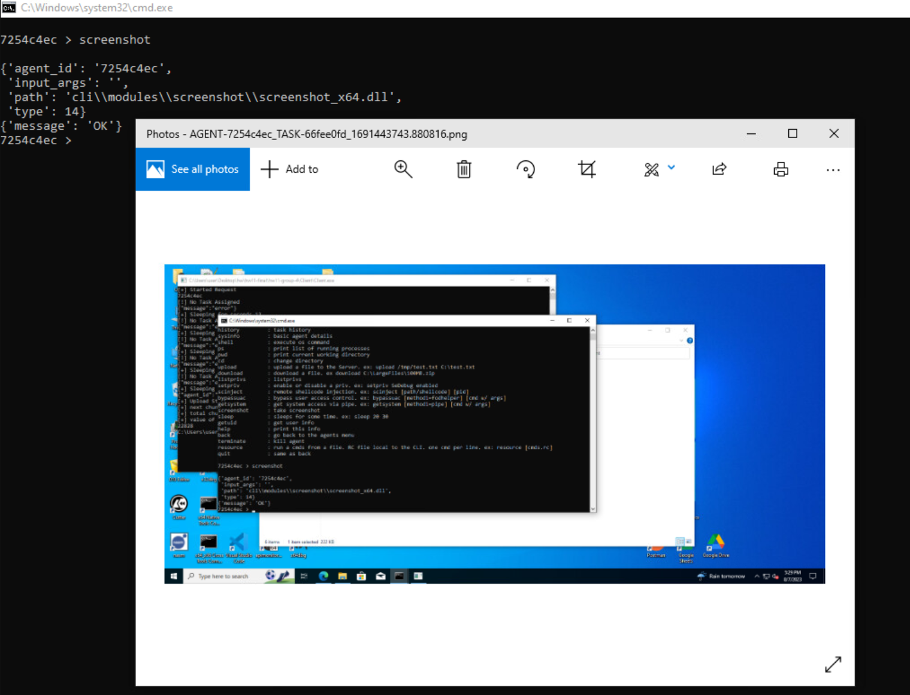
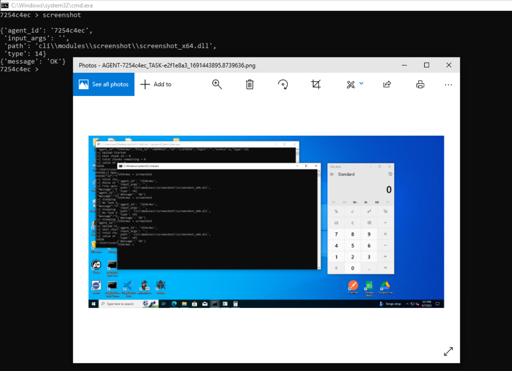
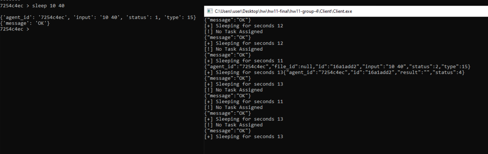
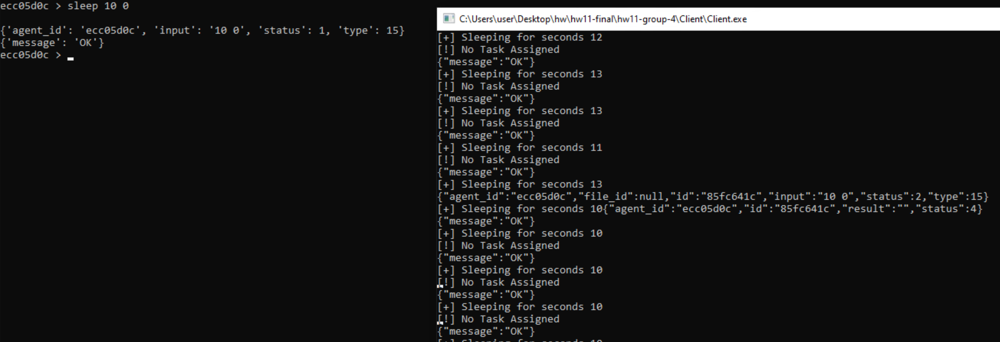

# **HW11 Tests**

## **Setup**
In order to test our project, please follow these steps that will help you setup the environment:
* Run "run-server.bat" file located in Server/ directory. This will start the server.
* Run "run-cli.bat" file located in Server/ directory. This will open a CLI tool to interact with the server.
* Run "compile.bat" file located in Client/ directory from the native cmd.
* Run "run.bat" file located in Client/ directory or simply run the "Client.exe" file present in Client/ directory.

Note that for some test cases we will run Client.exe in medium integrity (i.e., normally) while in some cases we will run Client.exe in high integrity (i.e., as administrator). We have mentioned when to run Client.exe in which integrity level.

Now, after the setup is done, we begin testing our peoject. Open the CLI, and type in the following command:
```raw
> agents
```
This will give you a new prompt as shown below:
```raw
agents >
```
Now, we will use our agent by typing in the following command, as is also shown in the figure above:
```raw
agents > use 7254c4ec
```
NOTE: For the sake of testing purpose, we have used an agent ID which was created when we ran Client.exe on our system. Please replace the agent ID with the one that is assigned to your agent when you are testing on your own system. This should be applied to all the commands that are mentioned furhter in this document. Also, the agent ID is subject to change in this document as well, as we will see further into the document.

After entering this command, notice the change in the command prompt, which changed from *agents* to your agent ID, as shown below:
```raw
7254c4ec >
```
Now we are ready to test out our new functionalities which are added in this project.

## **Testing**

Now that the setup is completed, we will move forward and test our new functionalities. The two new functionalities are as follows:
* Screenshot (Task type = 14): This functionality allows us to capture a screenshot of the current screen of the target machine and save it to our machine in Server/data/screenshots directory. The screenshot is directly sent to the server and not stored in disk of the target machine.
* Sleep with Jitter (Task type = 15): This functionality allows us to set custom sleep time and add jitter to it. Jitter is a random value added to the custom sleep time to make the sleep time more dynamic and non-repetitive.

Now, we will test these features.

### **Test 1 - Screenshot**

This functionality will allow us to take screenshot of the current screen of the target machine. The screenshot is sent directly to the server and then downloaded to our machine from the server. The screenshot is saved on our local machine in the *Server/data/screenshots* directory. Note that the screenshot is not stored in disk of the target machine.

Type in the following command in the agent command prompt to use this functionality:

```raw
7254c4ec > screenshot
```

This will take a screenshot of the current screen of the target machine and send it to our server and then downloaded to our machine and saved in *Server/data/screenshots* with the naming convention: "AGENT-*agent_id*_TASK-*task_id*_*seconds_till_epoch*.png" as defined in the assignment requirements.

The following image showcases the scenario:



You can note the naming convention in the name of the image.

Now, open *Calculator.exe* in the target machine and again type in the following command:

```raw
7254c4ec > screenshot
```

Now, open the new screenshot, it will have the screen of the target machine with *Calculator.exe* in it. The following image showcases this scenario:



You can note the presence of *Calculator.exe* in the screenshot and also the naming convention in the name of the image.

This proves that our *Screenshot* functionality is working properly as expected.

### **Test 2 - Sleep with Jitter**

This functionality allows us to set a custom sleep time of *Client.exe* that it uses between requesting tasks. We can also add our own custom jitter amount to the sleep time. Jitter is basically a random value that is added to the base sleep time to make it random, dynamic and non-repetitive.

We provide the base sleep time and jitter percentage to the CLI command. The default jitter percentage is set to 25%. Type in the following command in the agent command prompt to set the base sleep time of 10 seconds with jitter percentage of 40%:

```raw
7254c4ec > sleep 10 40
```

This command will set base sleep time of 10 seconds with 40% jitter. Since 40% of 10 seconds is 4 seconds, a random number selected in the range of 1 to 4 (both inclusive) and added to 10, to make the sleep time random. For example, if the random number selected is 3, then it is added to 10 making it 13 seconds. Hence, *Client.exe* will sleep for 13 seconds before requesting another task. Next, it might sleep for 12 seconds, or any number of seconds between 11 seconds to 14 seconds (both inclusive).

The following image showcases this scenario perfectly:



Note that the sleep time is in the range of 11 seconds and 14 seconds (both inclusive) only.

Now, type in the following command to set base sleep time as 10 seconds and jitter percentage to 0%:

```raw
ecc05d0c > sleep 10 0
```

This will set base sleep time to 10 seconds and jitter percentage to 0%. Since 0% of 10 seconds is 0 seconds, 0 is added to 10 seconds keeping it 10 seconds only. Hence, you will notice that the sleep time will be 10 seconds always. *Client.exe* will always sleep for 10 seconds before requesting another task.

The following image showcases this scenario perfectly:



Note that sleep time is 10 seconds in all the cases.

This shows that our *Sleep with Jitter* feature is working perfectly as expected.

## **Conclusion**

We can conclude that all the newly added features are working as expected and also errors are handled as expected.