# **HW4 Tests**

## **Setup**
In order to test our project, please follow these steps that will help you setup the environment:
* Run "run-server.bat" file located in Server/ directory. This will start the server.
* Run "run-cli.bat" file located in Server/ directory. This will open a CLI tool to interact with the server.
* Run "Client.exe" in Client/x64/Debug/ directory. This will run our main code, and create and register an agent on the server.
* Note down the agent ID assigned to this agent. In our case, for testing purpose, it was "4b65f450" as shown in the figure below:

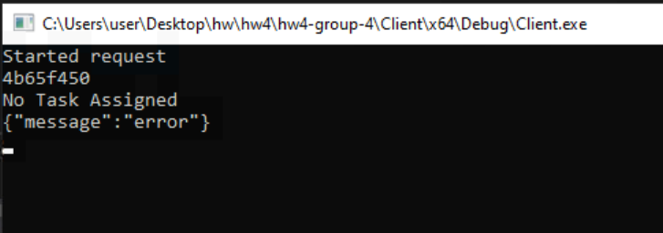

Now, after the setup is done, we begin testing our peoject. Open the CLI, and type in the following command:
```raw
> agents
```
This will give you a new prompt as shown in the figure below:

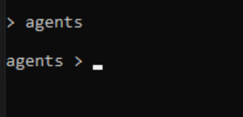

Now, to list down all the registered agents and verify the agent creation and registration process, type in the following command:
```raw
agents > list
```
This will give you output something like in the figure shown below:

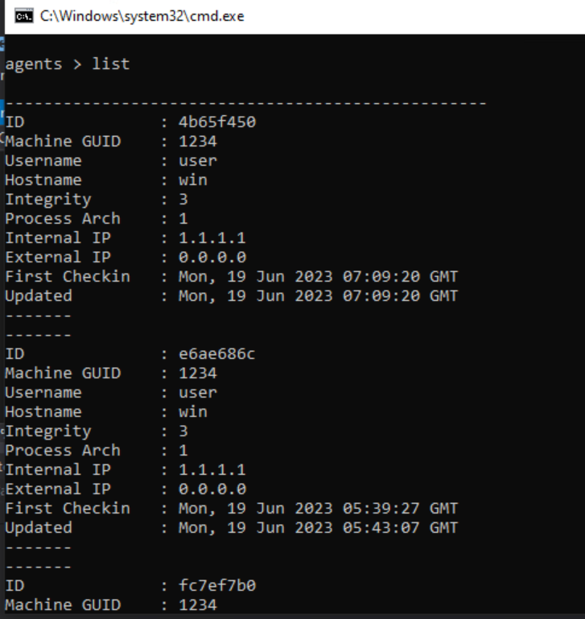

Notice that the first listed agent has the agent ID of "4b65f450" which verifies that our created agent is registered successfully.
Now, we will use our agent by typing in the following command:
```raw
agents > use 4b65f450
```
NOTE: For the sake of testing purpose, we have used an agent ID which was created when we ran Client.exe on our system. Please replace the agent ID with the one that is assigned to your agent when you are testing on your own system. This should be applied to all the commands that are mentioned furhter in this document.

On entering this command, you will see an output something like in the figure shown below. Notice the change in prompt from agents to the agent_id.

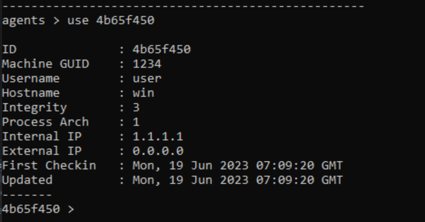

Now, to list down all the functionalities that you can perform on this prompt, type in the following command:
```raw
4b65f450 > help
```

This will give you an output similar to the figure shown below:

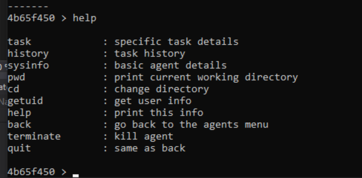

## **Testing**
Now that the setup is completed, we test our project by assigning tasks to the agent and running all the required commands in the CLI.

### **Test 1 - sysinfo**
Type in the following command to output the system information of the agent:
```raw
4b65f450 > sysinfo
```

This will give you an output similar to the following image:

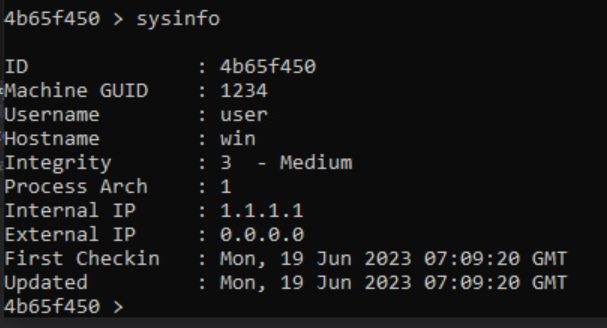

### **Test 2 - pwd**
Type in the following command to display the current working directory of the agent:
```raw
4b65f450 > pwd
```

Following image is the output you will get on the CLI:

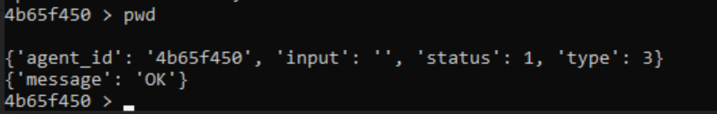

In the command prompt where you ran Client.exe, you will see the current working directory of the agent printed as shown in the image below (output may vary based on your install-location of our project):

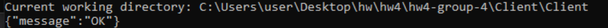

### **Test 3 - cd**
Type in the following command to go up one directory of the agent:
```raw
4b65f450 > cd ..
```

Following image is the output you will recieve on the CLI:

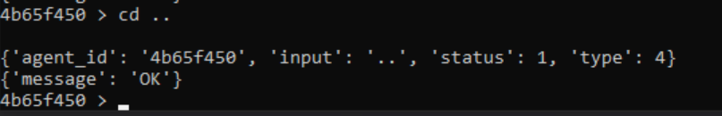

In the Client.exe command prompt, you will see a message printed as shown in the figure below:

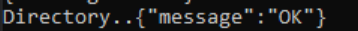

You can verify by again running the "pwd" command and see the output in Client.exe command prompt as shown in the figure below:

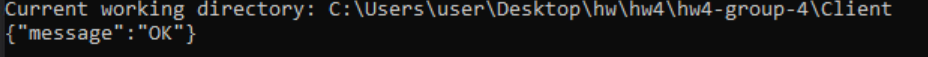

Notice that now we have gone up one directory than before.

### **Test 4 - cd to an invalid location**
Type in the following command to go to an invalid directory, that is, to a location that does not exist:
```raw
4b65f450 > cd no_such_directory
```

This will give you an output in the CLI as shown in the figure below:

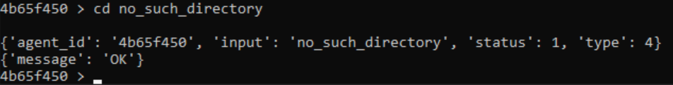

The Client.exe command prommpt will also display a message denoting that it failed to retrieve such directory as shown in the figure below:


### **Test 5 - getuid**
Type in the following command to get the username of the user who is running the agent(or process):
```raw
4b65f450 > getuid
```

The CLI will show you an output as shown in the figure below:

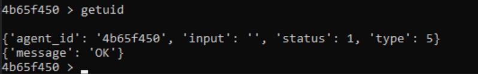

You can see the result of this command in the Client.exe command prompt as shown in the figure below:

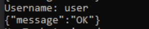

### **Test 6 - task**
Type in the following command to list down all the currently running (or active) tasks of the agent:
```raw
4b65f450 > task
```

Since we do not have any active running tasks for the agent and all the assigned task before are completed, the output will show nothing, as shown in the image below:

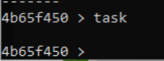

### **Test 7 - Invalid Task**
In this test, we will see the behaviour of the agent when it is assigned an invalid task, that is, a task that is not supported.

Hence, in order to achieve this scenario, we created a custom POST request with the help of Postman, and registered a new custom task with the value of type field as some random number which is not defined in the source code (here, we have assigned it as 404).

Follow the steps below in order to perform this test:
* We will first need to create a Base64 encoded string of the task. To do that:
    * Open a web browser and go to https://base64encode.org
    * Type in the following data that we will later encode:
    ```raw
    {
        "agent_id": "4b65f450",
        "input": 1,
        "type": 404
    }
    ```
    * Select the destination character set as UTF-8 and the destination newline separator as CRLF (Windows) and then click Encode button.
    * Copy the resultant Base64 encoded string.
    
    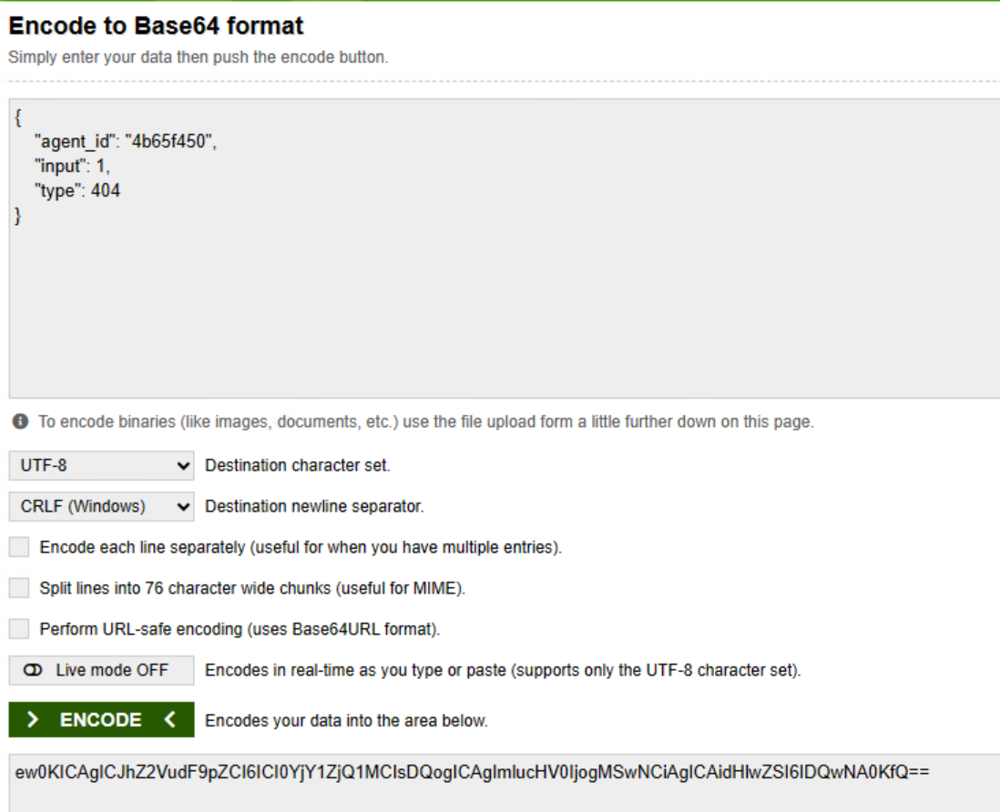

* Now, we will utilise this string in our POST request. To do that:
    * Open Postman application. You can download Postman application from https://www.postman.com/downloads/ or you can also use the web-based version.
    * Create a new request and select POST from the drop-down menu.
    * Type in the following request in the request bar:
    ```raw
    127.0.0.1:5000/admin/api/task
    ```
    * Click on Body tab and provide the Base64 encoded string as data field value as shown in the image below:

    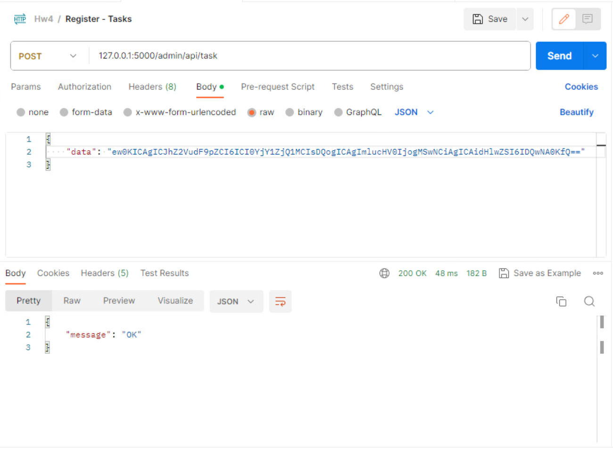

    * Click on Send. This will send a new custom task to the agent.

* In the Client.exe command prompt, you will notice a message displaying that the task is not supported as shown in the image below:

    

### **Test 8 - history**
Type in the following command to show the tasks that were assigned to the agent and their status, whether completed, failed or not supported:
```raw
4b65f450 > history
```

In the CLI, you can see all the task details that were assigned to the agent and their status as shown in the image below. Notice that the recent task, which was a custom task created for Test 7, has the status as "Not supported", while the next task has status as "Completed" since it is of Test 5 and the third has its status as "Failed" which was due to Test 4.

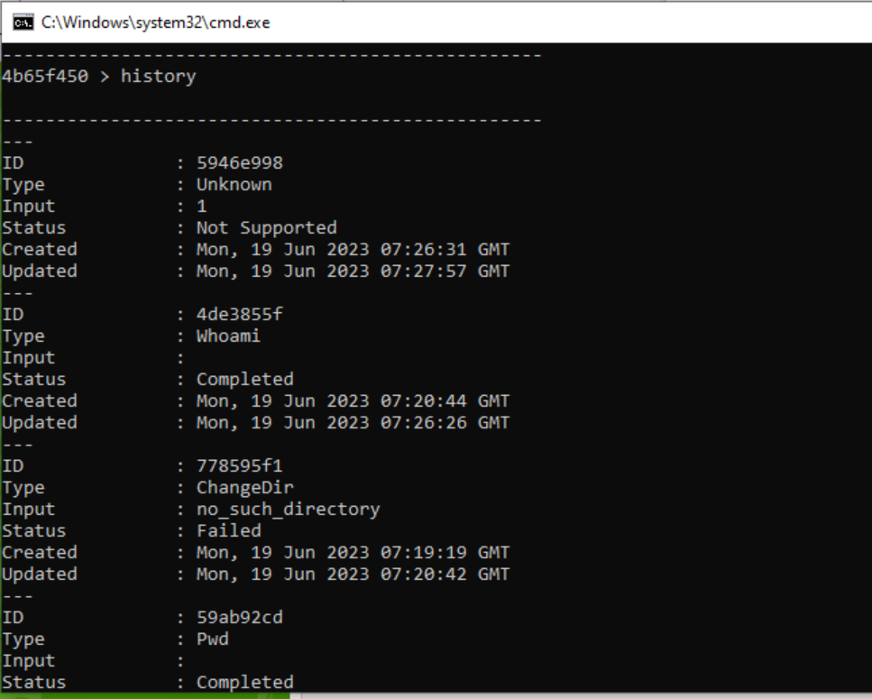

### **Test 9 - terminate**
Finally, we test the terminate command that terminates the agent, that is, terminates the process. Type in the following command to do so:
```raw
4b65f450 > terminate
```

You will see an output in the CLI similar to the image shown below:

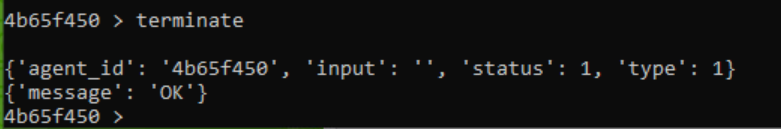

In the Client.exe command prompt, the process ends and displays an output that says that the termiation is completed and exits the process, as shown in the image below:

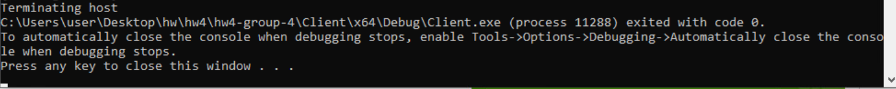

## **Conclusion**
Now, we have tested all the possible scenarios and our project has handled all the scenarios as expected.