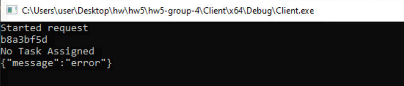
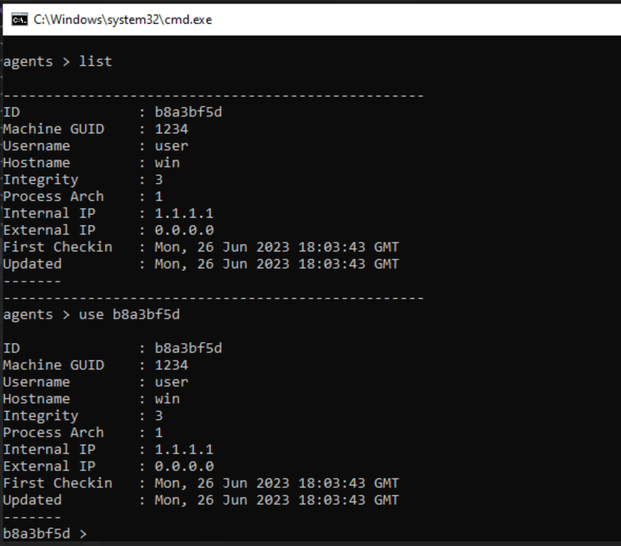
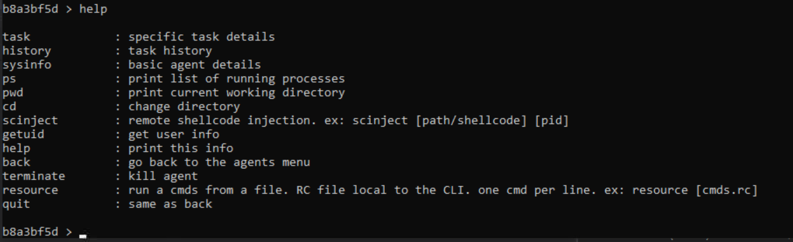
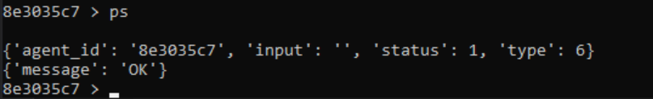
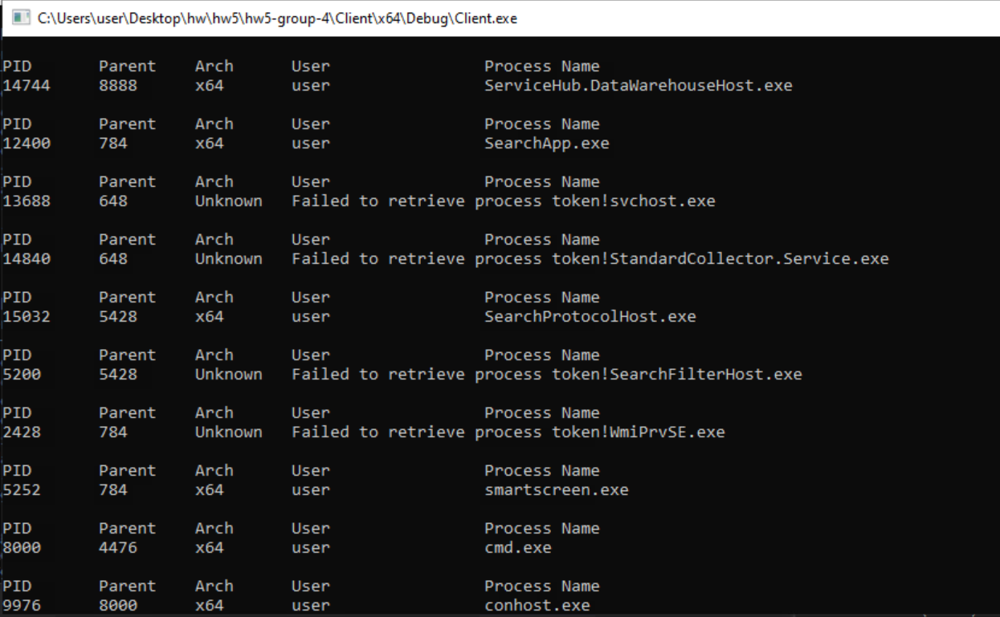
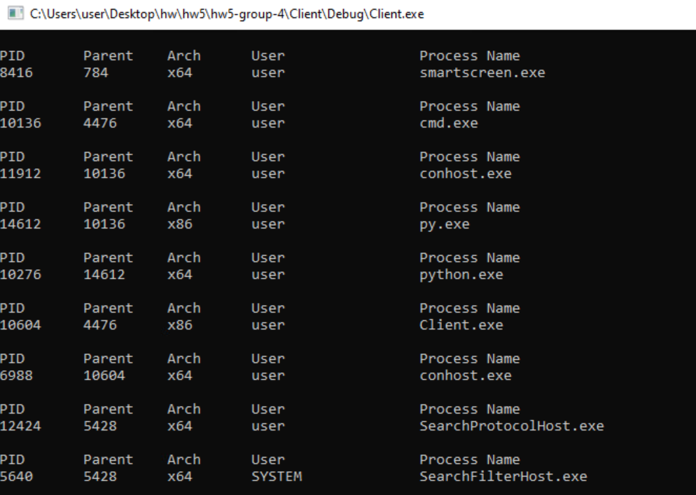
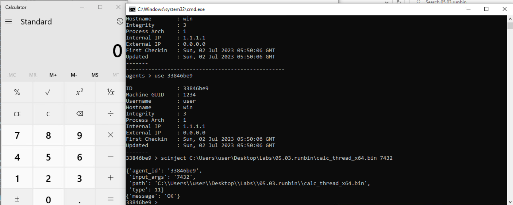
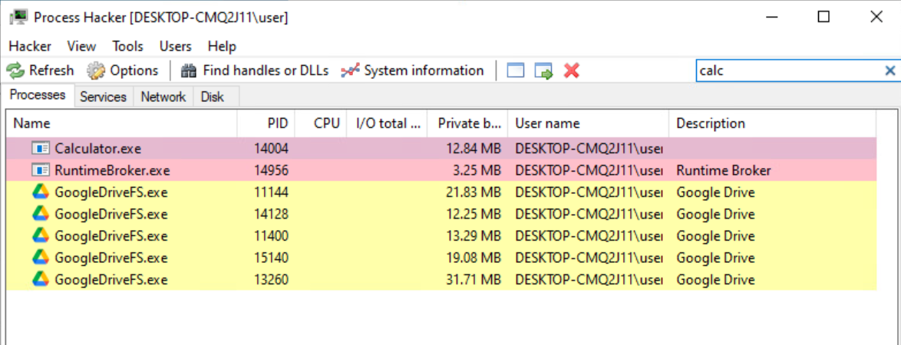

# **HW5 Tests**

## **Setup**
In order to test our project, please follow these steps that will help you setup the environment:
* Run "run-server.bat" file located in Server/ directory. This will start the server.
* Run "run-cli.bat" file located in Server/ directory. This will open a CLI tool to interact with the server.
* Run "Client.exe" in Client/x64/Debug/ directory. This will run our main code, and create and register an agent on the server.
* Note down the agent ID assigned to this agent. In our case, for testing purpose, it was *b8a3bf5d* (which will change over course of this project) as shown in the figure below:





Now, after the setup is done, we begin testing our peoject. Open the CLI, and type in the following command:
```raw
> agents
```
This will give you a new prompt as shown below:
```raw
agents >
```

Now, to list down all the registered agents and verify the agent creation and registration process, type in the following command:
```raw
agents > list
```
This will give you output something like in the figure shown below:





Notice that the first listed agent has the agent ID of *b8a3bf5d* which verifies that our created agent is registered successfully.
Now, we will use our agent by typing in the following command, as is also shown in the figure above:
```raw
agents > use b8a3bf5d
```
NOTE: For the sake of testing purpose, we have used an agent ID which was created when we ran Client.exe on our system. Please replace the agent ID with the one that is assigned to your agent when you are testing on your own system. This should be applied to all the commands that are mentioned furhter in this document.

On entering this command, you will see an output something like in the figure shown below. Notice the change in prompt from agents to the agent_id.

Now, to list down all the functionalities that you can perform on this prompt, type in the following command:
```raw
b8a3bf5d > help
```

This will give you an output similar to the figure shown below:





Notice that we have 2 new functionalities added, namely, "ps" and "scinject".

## **Testing**
Now that the setup is completed, we test our project by assigning tasks to the agent and running all the required commands in the CLI. Here, since we have already demonstrated tests for the commands included in hw4, we will focus our testing on the two newly added commands only, that is, "ps" command and "scinject" command.

### **Test 1 - ps**
For this test, we have freshly run a new agent with an agent ID of *8e3035c7*.
Type in the following command to output details about all the process running on the target system:
```raw
8e3035c7 > ps
```

This will give you an output in the CLI like in the image below:





The command prompt where you ran Client.exe, will show you an output like in the image below:





Notice that the output will show you a list of all the processes running on the target system, that will include the following details regarding each process:
* PID - Process ID
* Parent - Parent Process ID
* Arch - Architecture used
* User - Owner of the process
* Process Name - Name of the process

However, notice that in some processes, we can see the user field as "Failed to retrieve process token!". This is because the Client.exe has not enough permissions to get the process owner information.

### **Test 2 - ps with admin rights**
In Test 1, we observed that we were unable to retrieve information on process owner in some of the processes. Hence, to solve that issue, we can run the Client.exe as administrator so as to give it admin rights. To do that, navigate to Client/Debug/ directory where you will find Client.exe which needs to ber run as administrator.

After running Client.exe as administrator, follow the steps in Test 1 to execute ps command. Note that a new agent ID will be created when you run Client.exe as an administrator. In this case, you will see output similar to the image below:





Notice that now one of the process has its owner mentioned as "SYSTEM". This shows that our code works for both normal commands execution and commands execution as administrator.

### **Test 3 - scinject**
The scinject functionality allows you to inject a shellcode (in the .bin file format) to the given process (identified through PID) on the target machine and execute it. To use this functionality, the following is the syntax of how to use it:

```raw
scinject [bin_file_path] [PID]
```

To test this functionality, we have run another agent with agent ID of *33846be9*. Open the Notepad if it is not open. We will be injecting the shellcode stored in *calc_thread_x64.bin* file in the *notepad.exe* running on the target machine. The PID of *notepad.exe* is 7432. Type in the following command in the agent ID command prompt to execute scinject command:

```raw
33846be9 > scinject C:\Users\user\Desktop\Labs\05.03.runbin\calc_thread_x64.bin 7432
```

NOTE: Here, we have used the path for the bin file on our machine, which may vary based on where you have stored your BIN file. Also, the PID value used is the PID of *notepad.exe* running on the target machine which may vary for you.

Once you press Enter to execute this command, the *calculator.exe* will open up shortly as can be seen in the image below.





You can also verify that the Calculator is opened using Process Hacker as shown in the image below.





## **Conclusion**

Now, we have successfully tested all the new functionalities added. Our project handled all the test scenarios as expected.