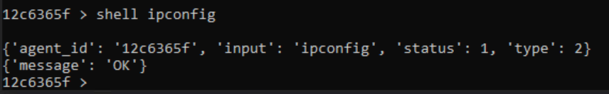

# **HW6 Tests**

## **Setup**
In order to test our project, please follow these steps that will help you setup the environment:
* Run "run-server.bat" file located in Server/ directory. This will start the server.
* Run "run-cli.bat" file located in Server/ directory. This will open a CLI tool to interact with the server.
* Run "compile.bat" file located in Client/ directory from the native cmd.
* Run "run.bat" file located in Client/ directory or simply run the "Client.exe" file present in Client/ directory.
* Note down the agent ID assigned to this agent. In our case, for testing purpose, it was *12c6365f* (which will change over course of this project) as shown in the figure below:


Now, after the setup is done, we begin testing our peoject. Open the CLI, and type in the following command:
```raw
> agents
```
This will give you a new prompt as shown below:
```raw
agents >
```
Now, we will use our agent by typing in the following command, as is also shown in the figure above:
```raw
agents > use 12c6365f
```
NOTE: For the sake of testing purpose, we have used an agent ID which was created when we ran Client.exe on our system. Please replace the agent ID with the one that is assigned to your agent when you are testing on your own system. This should be applied to all the commands that are mentioned furhter in this document.

After entering this command, notice the change in the command prompt, which changed from *agents* to your agent ID, as shown below:
```raw
12c6365f >
```
Now we are ready to test out our new functionalities which are added in this project.

## **Testing**
Now that the setup is completed, we will move forward and test our new functionalities. The two new functionalities added are:
* Shell task (type = 2) - It allows us to enter a shell command (like ipconfig) from our CLI which will then be run on the Client side (the target machine)
* Download task (type = 7) - It allows us to upload a file from our machine to the server, which will be downloaded by the client (or the target machine) via the Download task

### **Test 1 - shell ipconfig**
For this test, the command structure is as given below:

```raw
shell [command with arguments]
```

First, we will test the *ipconfig* command. To do that, type in the following command:

```raw
12c6365f > shell ipconfig
```

This will make the client (target machine) execute this command and give the output of this command. The following image is how it looks like in the CLI when it is run:



The command prompt where the Client.exe is running, will show you the output of the *ipconfig* command showing that it executed the command.

### **Test 2 - shell whoami /groups**
In this test, we will show that you can also provide commands with arguments too. Here, we will test the command *whoami /groups*. To do that, type in the following command:

```raw
12c6365f > shell whoami /groups
```

The CLI will show an output similar to the image shown below:


The command prompt where the Client.exe is running, will show you the output of the *whoami /groups* command showing that it executed the command.

### **Test 3 - shell calc.exe**
In this test, we will show that you can even give commands that does not yield any text output, but instead spawn an application as a result. Here, we will spawn the Calculator application in the target machine with the help of *shell* command functionality. To do that, type in the following command:

```raw
12c6365f > shell calc.exe
```

This will spawn a Calculator on the target machine. The following image showcases the effect of this command:


### **Test 4 - Download**
Here, we will test the *upload* functionality in our CLI, that allows us to upload a file to the server for the agent to download.

Hence, first we will need two test files to upload to our server. We have used *5MB.zip* and *10MB.zip* as our test files which we will be uploading to our server. These files will be subsequently downloaded on the Client machine on the path that we provide along with the filename.

First of all, we will check the MD5 hashes of the two files before uploading them on the server. To do that, we will use CertUtil tool which can be used as following:

```raw
certutil -hashfile file_path md5
```

To calculate the hashes of *5MB.zip* and *10MB.zip* files, type in the following commands in a command prompt, one by one:

``` raw
> certutil -hashfile C:\Users\user\Desktop\hw\5MB.zip md5
> certutil -hashfile C:\Users\user\Desktop\hw\10MB.zip md5
```

NOTE: Here, the file path used is where we stored the two files in our machine. The file path may vary based on your preferred storage location.

The hashes of the two files are as follows:
* MD5 hash of 5MB.zip file = b3215c06647bc550406a9c8ccc378756
* MD5 hash of 10MB.zip file = 3aa55f03c298b83cd7708e90d289afbd

The following image shows the MD5 hash calculated of *5MB.zip* and *10MB.zip* using the CertUtil tool:


Now, we will be uploading these two files to the server, and make the agent download these files. We will make the agent download these files and save them in the directory "C:\Users\user\Desktop\hw\hw6\". Note that this is the directory that exists on the Client machine (or the target machine). We will also make the client save those files as *5MB-new.zip* and *10MB-new.zip* respectively.

To use the upload functionality in CLI, the following is the syntax:

```raw
upload [file_path_on_your_machine] [file_path_on_client_machine]
```

To do that, type in the following commands in CLI one by one:

```raw
12c6365f > upload C:\Users\user\Desktop\hw\5MB.zip C:\Users\user\Desktop\hw\hw6\5MB-new.zip
12c6365f > upload C:\Users\user\Desktop\hw\10MB.zip C:\Users\user\Desktop\hw\hw6\10MB-new.zip
```

Here, with these two commands, we uploaded the two files from our machine and provided the download path, along with the new file names, for the client to download and store.

The following is the image of how the output of these 2 commands will look like in the CLI:


Now, to verify that the files were successfully uploaded and downloaded without any modification of files mmidway, we will again calculate the hashes of the newly downloaded files, i.e. *5MB-new.zip* and *10MB-new.zip*. To do that, type in the following commands in a new command prompt:

```raw
> certutil -hashfile C:\Users\user\Desktop\hw\hw6\5MB-new.zip md5
> certutil -hashfile C:\Users\user\Desktop\hw\hw6\10MB-new.zip md5
```

The hashes calculated are as follows:
* MD5 hash of 5MB-new.zip file = b3215c06647bc550406a9c8ccc378756
* MD5 hash of 10MB-new.zip file = 3aa55f03c298b83cd7708e90d289afbd

The following image showcases the same result:


Clearly, the the hashes of *5MB.zip* and *5MB-new.zip* matches. For clear viewing, the following image showcases the hashes of *5MB.zip* and *5MB-new.zip* back-to-back:


Similarly, we can verify that the hashes of *10MB.zip* and *10MB-new.zip* match, as shown in the image below for better viewing:


This shows that the files are successfully uploaded from our machine, downloaded on the client machine successfully on the path we provide and saved with the name we provide.

## **Conclusion**
Now, we have successfully tested all the new functionalities added. Our project handled all the test scenarios as expected.