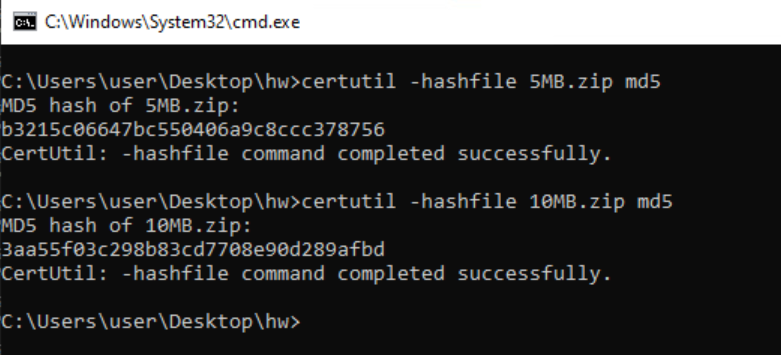
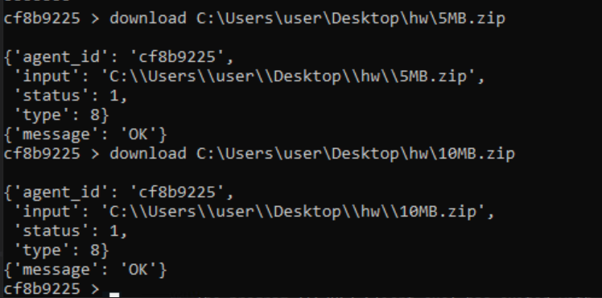
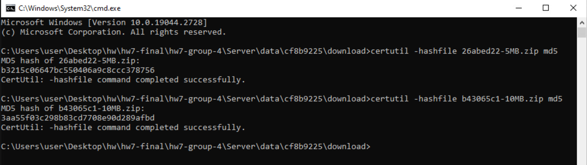

test.md

# **HW7 Tests**

## **Setup**
In order to test our project, please follow these steps that will help you setup the environment:
* Run "run-server.bat" file located in Server/ directory. This will start the server.
* Run "run-cli.bat" file located in Server/ directory. This will open a CLI tool to interact with the server.
* Run Client.exe in the Client/x64/Debug/ directory.
* Note down the agent ID assigned to this agent. In our case, for testing purpose, it was *c8fb9225*.

Now, after the setup is done, we begin testing our peoject. Open the CLI, and type in the following command:
```raw
> agents
```
This will give you a new prompt as shown below:
```raw
agents >
```
Now, we will use our agent by typing in the following command, as is also shown in the figure above:
```raw
agents > use c8fb9225
```
NOTE: For the sake of testing purpose, we have used an agent ID which was created when we ran Client.exe on our system. Please replace the agent ID with the one that is assigned to your agent when you are testing on your own system. This should be applied to all the commands that are mentioned furhter in this document.

After entering this command, notice the change in the command prompt, which changed from *agents* to your agent ID, as shown below:
```raw
c8fb9225 >
```
Now we are ready to test out our new functionalities which are added in this project.

## **Testing**
Now that the setup is completed, we will move forward and test our new functionalities. The new functionality added is the "Download" functionality on the CLI. It enables us to download any file present in the Client machine to our own machine.

To do that, the Client machine will first upload the file to our server, so that we could download that file from the server.


### **Test 1 - Upload Task**
Here, we will test the *download* functionality in our CLI, that allows us to download a file from the server, which was uploaded to the server by the client. For this we have implemented an upload task in Client machine so as to manage upload of file to the server.

Hence, first we will need two test files on the client. We have used *5MB.zip* and *10MB.zip* as our test files which the client will be uploading to our server. These files will be subsequently downloaded from the server by us.

First of all, we will check the MD5 hashes of the two files before uploading them on the server. To do that, we will use CertUtil tool which can be used as following:

```raw
certutil -hashfile file_path md5
```

To calculate the hashes of *5MB.zip* and *10MB.zip* files, type in the following commands in a command prompt, one by one:

``` raw
> certutil -hashfile C:\Users\user\Desktop\hw\5MB.zip md5
> certutil -hashfile C:\Users\user\Desktop\hw\10MB.zip md5
```

NOTE: Here, the file path used is where we stored the two files in our machine. The file path may vary based on your preferred storage location.

The hashes of the two files are as follows:
* MD5 hash of 5MB.zip file = b3215c06647bc550406a9c8ccc378756
* MD5 hash of 10MB.zip file = 3aa55f03c298b83cd7708e90d289afbd

The following image shows the MD5 hash calculated of *5MB.zip* and *10MB.zip* using the CertUtil tool:



Now, we will make the agent upload these files to the server and also then download those files to our machine.

To use the download functionality in CLI, the following is the syntax:

```raw
download [path_to_file]
```

To do that, type in the following commands in CLI one by one:

```raw
c8fb9225 > download C:\Users\user\Desktop\hw\5MB.zip
c8fb9225 > download C:\Users\user\Desktop\hw\10MB.zip 
```

Here, with these two commands, we made the client upload the two files from the client to the server (provided the target file path),  for us to download and store.

The following is the image of how the output of these 2 commands will look like in the CLI:



Now, to verify that the files were successfully uploaded and downloaded without any modification of files midway, we will again calculate the hashes of the newly downloaded files. The two downloaded files will be located in the the following file path:

```raw
/hw7-group-4/Server/data/[agent_id]/download/
```

For us, it was */hw7-group-4/Server/data/c8fb9225/download/*. Note that agent_id might vary when you try to run this project on your own machine, hence, the file path will vary accordingly.

To calculate the hashes of the newly downloaded files, first go to the above directory and type in the following commands in a command prompt:

```raw
> certutil -hashfile 26abed22-5MB.zip md5
> certutil -hashfile b43065c1-10MB.zip md5
```

NOTE: Note that the file name, although contains "5MB" and "10MB" to denote which file was downloaded, the filenames are randomly assigned and can vary when you test this project. Hence, change the filenames accordingly while testing.

The hashes calculated are as follows:
* MD5 hash of 26abed22-5MB.zip file = b3215c06647bc550406a9c8ccc378756
* MD5 hash of b43065c1-10MB.zip file = 3aa55f03c298b83cd7708e90d289afbd

The following image showcases the same result:



Clearly, the the hashes of *5MB.zip* and *26abed22-5MB.zip* matches. Similarly, we can verify that the hashes of *10MB.zip* and *b43065c1-10MB.zip* match.

This shows that the files are successfully uploaded from the client to the server and then downloaded to our machine without any modifications.

### **Test 2 - Strings**

To analyze the strings of this project and the the one before (hw6), we utilized teh *strings* tool. To extract the strings from the executables of both the projects, first find the locations of the respective executables.

The Client.exe of hw6 was located in /hw6-group-4/Client/ directory. It will be created once you run compile.bat present in the same directory.
The Client.exe of hw7 was located in /hw7-group-4/Client/ directory. It will be created once you run compile.bat present in the same directory.

We have done strings analysis on both the executables and saved the outputs in Testing/hw6strings.txt and Testing/hw7strings.txt respectively.
If you wish to do the same, do the  following :

* For hw6's Client.exe, navigate to the folder where it is located and type in the following command in the command prompt:
```raw
strings Client.exe >> [relative path]\hw7-group-4\Testing\hw6strings.txt
```
* Fow hw7's Client.exe, navigate to the folder where it is located and type in the following command in the command prompt:
```raw
strings Client.exe >> [relative path]\hw7-group-4\Testing\hw7strings.txt
```

NOTE: Note that you are supposed to fill in the relative path accordingly.

## **Conclusion**
Now, we have successfully tested all the new functionalities added. Our project handled all the test scenarios as expected.