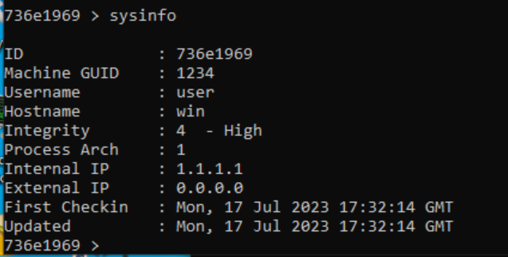

# **HW8 Tests**

## **Setup**
In order to test our project, please follow these steps that will help you setup the environment:
* Run "run-server.bat" file located in Server/ directory. This will start the server.
* Run "run-cli.bat" file located in Server/ directory. This will open a CLI tool to interact with the server.
* Run "compile.bat" file located in Client/ directory from the native cmd.
* Run "run.bat" file located in Client/ directory or simply run the "Client.exe" file present in Client/ directory.
* Note down the agent ID assigned to this agent. In our case, for testing purpose, it was *835d0499* (which will change over course of this project).

Now, after the setup is done, we begin testing our peoject. Open the CLI, and type in the following command:
```raw
> agents
```
This will give you a new prompt as shown below:
```raw
agents >
```
Now, we will use our agent by typing in the following command, as is also shown in the figure above:
```raw
agents > use 835d0499
```
NOTE: For the sake of testing purpose, we have used an agent ID which was created when we ran Client.exe on our system. Please replace the agent ID with the one that is assigned to your agent when you are testing on your own system. This should be applied to all the commands that are mentioned furhter in this document.

After entering this command, notice the change in the command prompt, which changed from *agents* to your agent ID, as shown below:
```raw
835d0499 >
```
Now we are ready to test out our new functionalities which are added in this project.

## **Testing**
Now that the setup is completed, we will move forward and test our new functionalities. The two new functionalities are as follows:
* Listprivs (task type = 9) - Lists the privileges and shows whether those privileges are enabled (denoted by TRUE) or disabled (denoted by FALSE).
* Setpriv (task type = 10) - Modifies the value of the privilege mentioned, i.e. enable (sets value to TRUE) or disable (sets value to FALSE) the mentioned privilege.

### **Test 1 - Success Case 1 - SeChangeNotifyPrivilege**
In this test, we will run the process (Client.exe) normally, in medium integrity level. Next, we will list down privileges and their status using *listprivs* and then try modifying privilege value of *SeChangeNotifyPrivilege* using *setpriv* functionality.

We had already created and registered a process when we finished our setup. To check the integrity level of the process, type in the following command:

```raw
835d0499 > sysinfo
```

The following is the output we got when we entered the above command. You will also get an output similar to the following image:


Note that the Integrity Level is mentioned as 3, which denotes a Medium integrity level.

Now, type in the following command to list down all the privileges and whether they are enabled or disabled:

```raw
835d0499 > listprivs
```

You will get an output in the CLI similar to the following image:


The Client.exe console will show an output similar to the image below:


Note that the value of *SeChangeNotifyPrivilege* is *TRUE* by default. We will change its value to *FALSE* by typing in the following command:

```raw
835d0499 > setpriv SeChangeNotifyPrivilege disabled
```

You will get a similar in the CLI as the following image:


The Client.exe console will show an output similar to the image below:


Note that it shows that the process was success. We can now verify the modification in the value bu again running *listprivs* command. This time, we get the output shown in the following image:


Note that the value of *SeChangeNotifyPrivilege* is now *FALSE*. This shows that our test case is a success.

### **Test 2 - Failure Case 1 - SeDebugPrivilege**
From the same process, we now check whether we can modify the value of the privilege *SeDebugPrivilege* or not. By default, the value of *SeDebugPrivilege* is set to *FALSE*.

Type in the following command to enable *SeDebugPrivilege*:

```raw
835d0499 > setpriv SeDebugPrivilege enabled
```

We get an output in the CLI similar to the following image:


The following image showcases what we got in the Client.exe console:


Note that the process failed. This is because we (or rather the Client.exe) do not have enough permission to modify this value.

Thus, we cannot change the value of *SeDebugPrivilege* with a Medium integrity level process.

### **Test 3 - Success Case 2 - SeDebugPrivilege**
Now, we try modifying the privilege value of *SeDebugPrivilege* using a High integrity level process.

For this, close the current Client.exe instance (if running) and start a new one with admin rights (Run Client.exe as administrator). This generates and registers a new process with a process ID of *736e1969* in our case (It may vary for you and change the corresponding values accordingly in further commands. or wherever necessary).

Now, type in the following command to verify the integrity level of the Client.exe as administrator:

```raw
736e1969 > sysinfo
```

The following image is the output in the CLI that we got:



Notice that now the integrity level value is 4, which denotes High integrity level.

Now, type in the following command to list down all the privileges:

```raw
736e1969 > listprivs
```

We get an output similar to the following image in the CLI:


The following image displays the output we got in the Client.exe console:


Notice that now some values of privileges which were *FALSE* before (in medium integrity level process) are now *TRUE*. However, note that the value of *SeDebugPrivilege* is still *FALSE*.

We will enable (set value to *TRUE*) the *SeDebugPrivilege* privilege by typing in the following command:

```raw
736e1969 > setpriv SeDebugPrivilege enabled
```

We get an output in our CLI as shown in the image below:


In the Client.exe console, we will recieve an output as showcased in the following image:


Note that now the process is success. This means that we are now able to modify the privilege value of *SeDebugPrivilege* as High integrity level process.

To verify this, again run the *listprivs* command, and see the output in the Client.exe console. We recieved an output as displayed in the following image:


Notice that now the value of *SeDebugPrivilege* is *TRUE*. This shows that our test is a success and we can modify privilege values with higher permissions.

## **Conclusion**
Now, we have successfully tested all the new functionalities added. Our project handled all the test scenarios as expected.