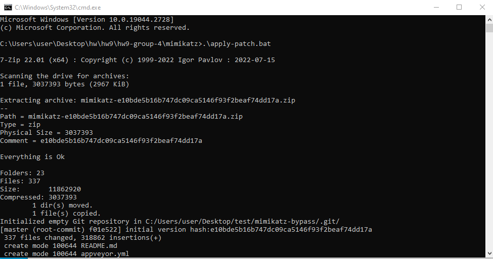
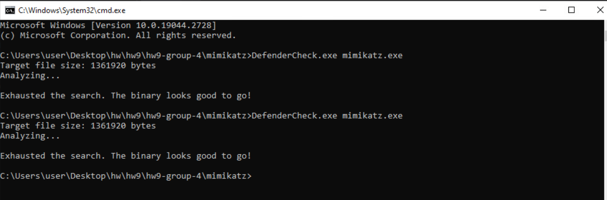
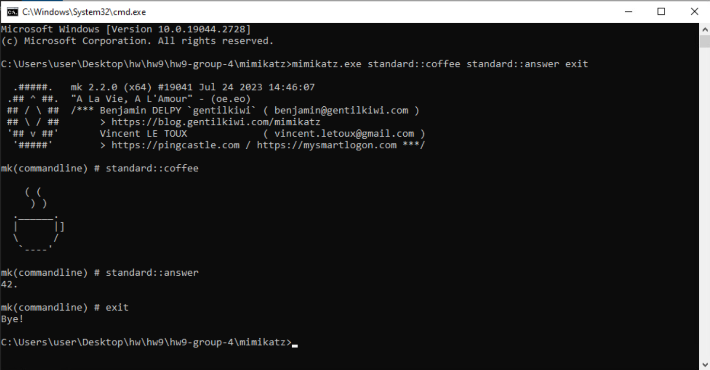

# **HW9 Tests**

In this project, we have successfully patched *mimikatz*, the version having commit hash of *e10bde5b16b747dc09ca5146f93f2beaf74dd17a*. Now, when you test the patched *mimikatz* against the *DefenderCheck.exe*, it will not match any signature related to the original *mimikatz* and flag the executable as non-malicious.

## **Setup**

We have documented all the patches necessary to evade detection in *CHANGELOG.md* file, and the full patch is stored in *defender.patch* file. In order to apply these patches, follow the following steps:

* Run the *apply-patch.bat* script to apply the new patches, that we did, to the *mimikatz version e10bde5b16b747dc09ca5146f93f2beaf74dd17a*. This will also create a *test* folder in the Desktop. The following image depicts the process when you run the *apply-patch.bat* script.



* Now, go to the directory "C:\Users\user\Desktop\test\mimikatz-bypass\". Here, open *mimikatz.sln*. This *mimikatz.sln* has *mimikatz* code with new applied patches.
* Set the release build to x64 architecture and build the solution. Build only *mimikatz* to save time.
* Once the build is successful, you will notice a new *x64* folder in the same directory. Head to this *x64* directory and locate *mimikatz.exe*. This *mimikatz.exe* will now be able to evade detection from *DefenderCheck.exe*.
* Copy and paste this *mimikatz.exe* in our *hw9-group-4/mimikatz/* directory for ease of access.

## **Tests**

Now that the setup is completed, we will test our project with the following two tests:

* Test 1 - Check whether the new *mimikatz.exe* is really able to evade detection or not.
* Test 2 - Check whether the new *mimikatz.exe* is able to perform basic functionalities even after applying patches or not.

### **Test 1 - Evasion Check**

In order to check whether the new *mimikatz.exe* is able to detect evasion or not, follow the following steps:

* Open a command prompt in directory "hw9-group-4/mimikatz/" where both *DefenderCheck.exe* and now the new *mimikatz.exe* are located, and run the following command to check whether *DefenderCheck.exe* is able to detect or match any known signatures for this new *mimikatz.exe* or not.

```raw
> DefenderCheck.exe mimikatz.exe
```

* You will notice that the *DefenderCheck.exe* has exhausted its search but is not able match any known signature with our new *mimikatz.exe*. However, just to be sure, run the above command again after approximately 20 seconds.
* The following image depicts the output of the test when we performed it approximately 20 seconds apart. As you can see, the new *mimikatz.exe* is now able to evade detection.



This shows that our first test is successful and the new *mimikatz.exe* with all the applied patches that we defined is now able to evade detection from *DefenderCheck.exe*

### **Test 2 - Mimikatz Basic Functionalities Check**

In order to check whether the new *mimikatz.exe* is able to perform basic functionalities or not, follow the following steps:

* Open a command prompt in the same directory, i.e. "hw9-group-4/mimikatz/".
* Type in the following command to check 3 *mimikatz* commands to test its functionalities:

```raw
> mimikatz.exe standard::coffee standard::answer exit
```

* The following image shows the output of this command:



Hence, this shows that the new patched *mimikatz.exe* is able to perform basic functionalities and our test is successful.

## **Conclusion**

To conclude, our new patched *mimikatz.exe* is now able to evade detection and also work properly. Hence, all of our test cases are sucessful.